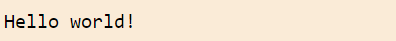
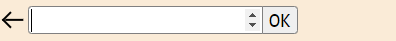
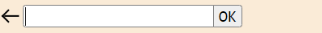
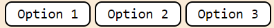
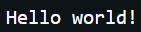
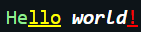
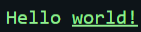

# TextGameEngine
Engine for text games

## Initialization
``` js
import { TextGameEngine, Titles } from "./TextGameEngine.js";
const tge = new TextGameEngine();
tge.init();
```
### TextGameEngine.init()
``` ts
const mainDiv = tge.init(titles: Titles, appendToBody: boolean);
```
* _titles_ - default: new Titles()
* _appendToBody_ - default: true
* Returns main element.


## Using
### TextGameEngine.print()
Print text.
``` ts
tge.print(text: string, newParagraph: boolean);
```
Parameter    | Default | Description
-------------|---------|-------------
text         | ""      | text to print
newParagraph | false   | add space before text



### TextGameEngine.num()
Ask player for a number
``` ts
const num = await tge.num(min: number | null, max: number | null, useChoose: boolean);
```
Parameter | Default | Description
----------|---------|-------------
min       | null    | Min number, null - no limit
max       | null    | Max number, null - no limit
useChoose | true    | Use _TextGameEngine.choose()_ if there are less then 16 int options



### TextGameEngine.text()
Ask player for a text
``` ts
const num = await tge.text(min: number, max: number, allowSpaces: boolean, trimSpaces: boolean);
```
Parameter   | Default | Description
------------|---------|-------------
min         | 0       | Min text length
max         | -1      | Max text length, -1 - no limit
allowSpaces | true    | Allow typing spaces
trimSpaces  | true    | Trim spaces after finishing input



### TextGameEngine.choose()
Ask player to choose one of the options

Returns index of chosen option
``` ts
const index = await tge.choose(options: string[], everyAtNewLine: boolean, removeNotChosen: boolean);
```
Parameter       | Default | Description
----------------|---------|-------------
options         |         | Options to choose
everyAtNewLine  | false   | Show every option on new line
removeNotChosen | false   | Remove not chosen options after choice



### TextGameEngine.wait()
Pause the game for a while.
``` ts
await tge.wait(seconds: number);
```
Parameter       | Default | Description
----------------|---------|-------------
seconds         | -1      | Seconds to wait, -1 - until player tap continue button

### TextGameEngine.clear()
Remove lines.
``` ts
tge.clear(lineCount: number);
```
Parameter | Default | Description
----------|---------|-------------
lineCount | -1      | Line count to remove, -1 to remove all lines


## Titles
Class that contain all titles. Used in _TextGameEngine.init()_
``` ts
const titles = new Titles();
titles.title = "Name of your game";
//or
const titles = new Titles(title, tapToCon);
```
Field    | Description
---------|--------------
title    | Title at the top of the page
tapToCon | Text "Tap to continue" when called _TextGameEngine.wait_ with -1
version  | Engine version. Assign an empty string to remove version tag from page.


## Text Formating
You can use special symbols in text to add colors and styles to your game.

### Special symbols:
Symbol       | Meaning
-------------|------------
&c           | Clear style
&b           | Bold style
&i           | Italic style
&u           | Underline style
&__digit__   | your style by this number (0-9) in _styles_
&&           | & symbol
^__color__^  | Color
^__number__^ | your style by this number in _styles_
^^           | ^ symbol

Set your own styles and colors:
```ts
TextGameEngine.setStyles(styles: string[], useStyles: boolean)
```
Call before _TextGameEngine.init_ if you want to use formatting in headers.

_useStyles_ - default true, set to false to disable text formatting

Strings in _styles_ can contain:
* c - Clear style
* b - Bold style
* i - Italic style
* u - Underline style
* color in single quotes

Style string examples:
* ui'red' - Underline, Italic, red
* 'blue'i - Italic, blue
* 'rgb(50, 220, 120)' - rgb(50, 220, 120) color
* cb'#ffff00' - Clear privious styles, bold, #ffff00 color

Text without formating:
```ts
TextGameEngine.print("Hello world!");
```


Text with formating:
```ts
TextGameEngine.setStyles(["'lightgreen'", "cu'red'"]);
TextGameEngine.print("&0He^yellow^&ullo&c &b&iworld&1!");
```


```ts
TextGameEngine.print("&0Hello &uworld!");
```



## Change Colors
All colors are in the first lines of the css file.
``` css
/* TextGameEngine-styles.css */
.theme-light {
	--color-back--: antiquewhite;
	--color-input--: white;
	--color-main--: #b5f392;
	--color-text--: black;
	--color-choosen-option--: lightgreen;
}
.theme-dark {
	--color-back--: #0d1418;
	--color-input--: #0b2a3d;
	--color-main--: #0f9e38;
	--color-text--: white;
	--color-choosen-option--: darkgreen;
}
```
